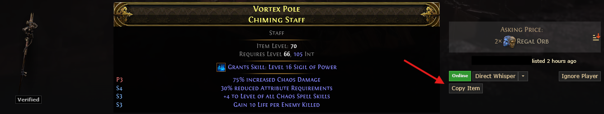

# poe-trade-to-pob
A Chrome extension to allow copying an item from the trade site to paste into Path of Building.
Tries to mimic the format from Ctrl+C on an item from the game itself.

Very basic testing has it working on both the PoE1 and PoE2 trade sites.

**Adds a button to the search results:**



**Puts content on your clipboard similar to:**

```
Vortex Cry
Acrid Wand
--------
Item Level: 77
Requires Level 72, 139 Int
--------
Grants Skill: Level 17 Decompose
--------
Gain 25% of Damage as Extra Fire Damage
+152 to maximum Mana
15% reduced Attribute Requirements
+4 to Level of all Chaos Spell Skills
14% increased Cast Speed
--------
```

## TODO List

- [ ] Handle implicit modifiers better in PoE2, like mods from Runes
- [ ] Detect corrupted
- [ ] Better detection for augmented requirements/attributes
- [ ] Proper handling of hybrid attribute requirements regarding augmented 

## Issues

Open issues on the repo. I will try to be responsive, but this is a simple QoL side project I threw together.

## Contributing

Pull Requests are welcome to fix bugs or if you want to add a feature.
